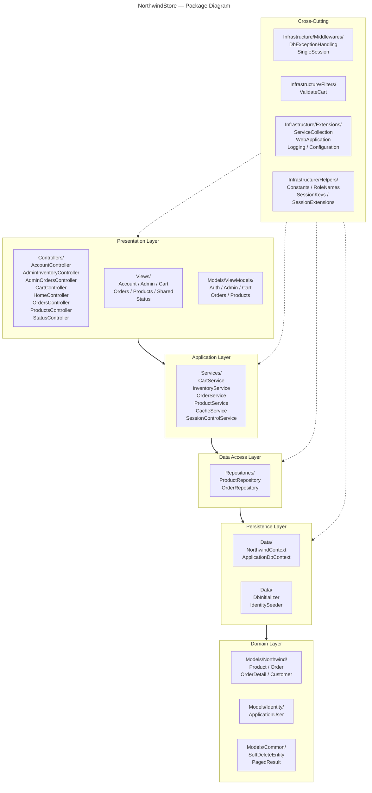

# 1. Summary

NorthwindStore is an ASP.NET Core MVC academic project for a complete Northwind purchasing and inventory flow. It includes product browsing, a temporary shopping cart, order creation, order details, automatic stock updates, administrative inventory reports, authentication, role-based authorization, server-side validations, EF Core transactions, soft delete, single active session control, LINQ queries, PostgreSQL connection pooling, and IMemoryCache invalidation after purchases or inventory changes.

The solution follows this responsibility flow:

Controller -> Service -> Repository -> DbContext -> PostgreSQL

Business logic is kept in services and repositories instead of controllers. The project also includes `db/schema.sql` with the complete PostgreSQL Northwind database adapted for the app, plus `db/seed.sql` for academic seed helpers.

# 2. Technologies Used

* ASP.NET Core MVC
* C#
* PostgreSQL
* Northwind Database
* Entity Framework Core
* Database First
* Npgsql
* ASP.NET Core Identity
* LINQ
* IMemoryCache
* HTML
* CSS
* JavaScript
* Git
* GitHub

# 3. Architecture

Layered Architecture with Repository + Service pattern. Data flows one-way:

```
Views/Controllers  →  Services  →  Repositories  →  Data/DbContext  →  PostgreSQL
```

Each layer depends only on the one below. Cross-cutting concerns (caching, auth, session) live in `Infrastructure/`.

| Layer | Folder | Responsibility |
|---|---|---|
| Presentation | `Controllers/`, `Views/`, `Models/ViewModels/` | HTTP handling, UI, DTOs |
| Application | `Services/` | Business logic, caching, orchestration |
| Data Access | `Repositories/` | LINQ queries, persistence |
| Persistence | `Data/` | DbContexts, migrations, seeders |
| Domain | `Models/Northwind/`, `Models/Identity/` | Entities and identity |
| Infrastructure | `Infrastructure/` | Middleware, filters, extensions, helpers |

All service and repository interfaces sit next to their implementations.

## 3.1 Package diagram



# 4. Installation

## 4.1 Clone the repository

```bash
git clone <repository-url>
cd <repository-folder>
```

## 4.2 Create the application database user

Run the credentials script against both databases:

```bash
psql -d northwind          -f db/credentials.sql
psql -d northwind_identity -f db/credentials.sql
```

This creates the `jef` role with a hashed password and grants the required privileges.

## 4.3 Configure database credentials

The application reads PostgreSQL credentials from `Secrets/secrets.json`. The file is already prepared for the local setup:

```json
{
  "ConnectionStrings": {
    "NorthwindConnection": "Host=localhost;Port=5432;Database=northwind;Username=jef;Password=<your-password>;Pooling=true;Minimum Pool Size=0;Maximum Pool Size=100;Connection Idle Lifetime=300",
    "IdentityConnection": "Host=localhost;Port=5432;Database=northwind_identity;Username=jef;Password=<your-password>;Pooling=true;Minimum Pool Size=0;Maximum Pool Size=50;Connection Idle Lifetime=300"
  }
}
```

`Secrets/secrets.json` is listed in `.gitignore` so it stays local and is never committed. `appsettings.json` does not store database passwords. Connection pooling is enabled in the connection strings with `Pooling=true`, `Minimum Pool Size`, `Maximum Pool Size`, and `Connection Idle Lifetime`.

## 4.4 Restore packages

```bash
dotnet restore
```

## 4.5 Prepare PostgreSQL

### 4.5.1 Install PostgreSQL on Debian

```bash
sudo apt update
sudo apt install -y postgresql postgresql-client
sudo systemctl enable --now postgresql
```

Switch to the `postgres` user and set a password for the initial superuser:

```bash
sudo -u postgres psql -c "ALTER USER postgres PASSWORD 'postgres';"
```

### 4.5.2 Install PostgreSQL on Windows

1. Download the installer from [https://www.postgresql.org/download/windows/](https://www.postgresql.org/download/windows/).
2. Run the installer and follow the wizard. When prompted:
   - Set the superuser (`postgres`) password to `postgres`.
   - Keep the default port `5432`.
3. After installation, open **pgAdmin** or **SQL Shell (psql)** and verify the server is running.

Enable `psql` in the terminal by adding PostgreSQL's `bin` directory to your `PATH` (typically `C:\Program Files\PostgreSQL\17\bin`).

### 4.5.3 Create the databases and load the schema

Create the Northwind and Identity databases:

```bash
createdb northwind
createdb northwind_identity
```

Then run the schema, seed and index files:

```bash
psql -d northwind -f db/schema.sql
psql -d northwind -f db/seed.sql
psql -d northwind -f db/index.sql
```

### 4.5.4 Scaffold the models (Database First)

Generate the Northwind models from the live PostgreSQL database:

```bash
dotnet ef dbcontext scaffold "Host=localhost;Port=5432;Database=northwind;Username=jef;Password=<your-password>;Pooling=true;Minimum Pool Size=0;Maximum Pool Size=100;Connection Idle Lifetime=300" Npgsql.EntityFrameworkCore.PostgreSQL --context NorthwindContext --context-dir Data --output-dir Models/Northwind --force --use-database-names
```

After scaffolding, keep the soft-delete columns from `db/schema.sql`. The app uses query filters for `is_deleted`, `deleted_at`, and `deleted_by`.

### 4.5.5 Database indexes

Performance indexes are defined in `db/index.sql` (run separately after the schema). They include:

| Index | Column(s) | Purpose |
|---|---|---|
| `ix_products_available` | `discontinued`, `units_in_stock` (partial, `is_deleted = false`) | Speeds up the available-products listing |
| `ix_products_name_trgm` | `product_name` (GIN trigram, partial `is_deleted = false`) | Accelerates `ILIKE` search by product name |
| `ix_products_low_stock` | `units_in_stock`, `discontinued` (partial, in-stock only) | Fast low-stock reports |
| `ix_products_discontinued` | `discontinued` (partial, `discontinued = true`) | Fast discontinued-products query |
| `ix_order_details_product` | `product_id` | Speeds up the most-purchased-products aggregation |
| `ix_orders_customer_date` | `customer_id`, `order_date` (partial, `is_deleted = false`) | Fast customer order history and sorting |

The trigram index requires the `pg_trgm` extension, which is enabled by `db/index.sql`.

## 4.6 Run the project

```bash
dotnet run
```

For watch mode:

```bash
dotnet watch run
```

When the app starts, `IdentitySeeder` creates the `Admin`, `Customer`, and `Employee` roles. `Employee` is kept for compatibility with previous academic work; this project protects the required routes with `Admin` and `Customer`.

## 4.7 Default admin user

The identity seed creates a default academic admin account:

| Field | Value |
|---|---|
| Email | `admin@northwind.local` |
| Password | `Admin123!` |
| Role | `Admin` |

The password is stored as an ASP.NET Core Identity password hash, not as plain text in the database.

To apply or repair this admin user in an existing `northwind_identity` database without recreating the databases, run:

```bash
psql -d postgres -f db/identity_admin_seed.sql
```

## 4.8 Protected routes

The root route `/` is a neutral home page and does not expose product, inventory, order, or customer data.

Protected MVC routes:

| Area | Controller | Access |
|---|---|---|
| Home | `HomeController.Index` | Public |
| Authentication | `AccountController.Login`, `Register`, `AccessDenied` | Public |
| Products | `ProductsController.Index`, `Details` | `Customer` only |
| Cart | `CartController` | `Customer` only |
| Customer orders | `OrdersController` | `Customer` only |
| Admin inventory | `AdminInventoryController` | `Admin` only |
| Admin orders | `AdminOrdersController` | `Admin` only |
| Status pages | `StatusController` | Public/internal error flow |

The navbar follows the same rules: product/cart/order links appear only for `Customer`, while inventory/order administration links appear only for `Admin`.

## 4.9 Publish in Release mode

```bash
dotnet publish -c Release -o ./publish
```

The `publish` folder contains the compiled application. Run it with:

```bash
dotnet ./publish/NorthwindStore.dll
```

# 5. Logging

Logging is configured with **Serilog** in `Infrastructure/Extensions/LoggingExtensions.cs`.

Detailed request/database logs are enabled only when `ASPNETCORE_ENVIRONMENT=Development`.
In non-development environments, the app writes only `Warning` and higher events to the console and does not create `logs/app-*.json` files. This avoids filling disk and slowing down production with high-volume EF query logs.

Development sinks:

| Output | Configuration |
|---|---|
| Console | `.WriteTo.Console()` |
| Rolling file (JSON) | `.WriteTo.File(new CompactJsonFormatter(), "logs/app-.json", ...)` |

Development file rolling policy:

| Setting | Value | Description |
|---|---|---|
| `rollingInterval` | `Day` | Creates a new file each day (`app-20260704.log`) |
| `fileSizeLimitBytes` | 10 MB | Rotates early if a file exceeds this size |
| `rollOnFileSizeLimit` | `true` | Enables size-based rotation in addition to daily |
| `retainedFileCountLimit` | 7 | Keeps only the last 7 files, older ones are deleted automatically |

File format (compact JSON, one event per line):

| Property | Description |
|---|---|
| `@t` | Timestamp (ISO 8601) |
| `@mt` | Message template |
| `@l` | Level (`INF`, `WRN`, `ERR`, `FTL`) |
| `@x` | Exception details (present on errors) |
| `@m` | Rendered message |

Example line:
```json
{"@t":"2026-07-04T15:29:46.316Z","@mt":"Database operation failed","@l":"ERROR","@x":"Npgsql.PostgresException: 42501: permission denied..."}
```

Query examples:
```bash
# Filter errors only
jq 'select(.["@l"] == "ERR")' logs/app-*.json

# Search for a specific message
jq 'select(.["@mt"] | test("product"))' logs/app-*.json
```
